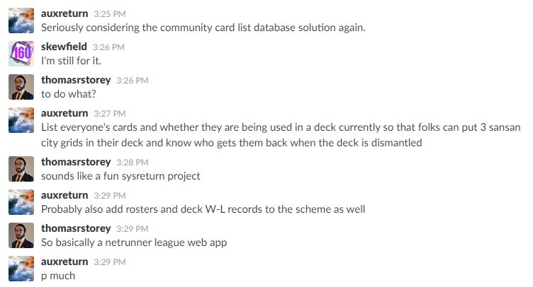

# Netrunner League Database
:office: :u7981: :runner:

## Note for Windows
**Use python 3.6**

Netrunner cards use unicode characters in their titles and text.
Python on windows has had problems with displaying unicode characters due to
the default behaviour of the command prompt not accepting characters outside
the ansi codepage and python not having a module to use the widechar printing 
api in windows to get around that. A solution was implemented starting in 3.6
with [PEP 528](https://www.python.org/dev/peps/pep-0528/). To not have things
throw codepage errors when shuffling data from db or file to console, use 
python 3.6
